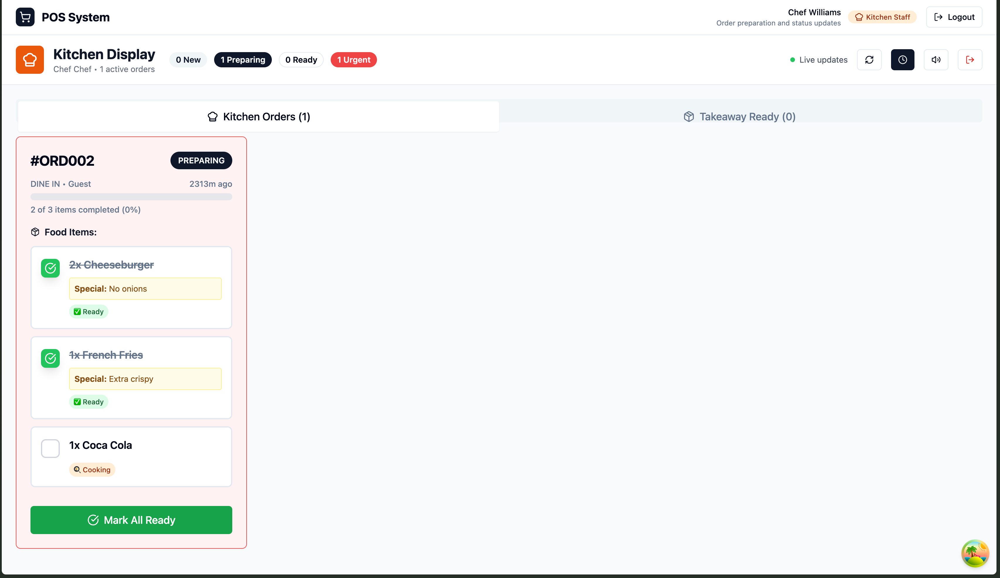

# 🍽️ Complete POS System - Professional Restaurant Management

> **A modern, enterprise-grade Point of Sale system built for the next generation of restaurants**

[](https://docker.com)
[](https://choosealicense.com/licenses/mit/)
[](https://golang.org)
[](https://reactjs.org)
[](https://typescriptlang.org)
[](https://postgresql.org)
[](https://tailwindcss.com)
[](https://cursor.sh)

## 🌟 **Built with Modern Technologies**

- **🔧 Backend:** Golang + Gin + PostgreSQL with raw SQL for maximum performance
- **⚡ Frontend:** React + TanStack Start + TypeScript + Tailwind CSS + shadcn/ui
- **🗄️ Database:** PostgreSQL with comprehensive schema and optimized queries
- **🐳 Infrastructure:** Docker containers with Docker Compose orchestration
- **🔐 Security:** JWT authentication with role-based access control (RBAC)
- **🧠 AI-Enhanced Development:** Advanced Cursor AI rules powered by Claude Sonnet 4 thinking

---

## 📸 **Beautiful Professional Interface**

### 🍽️ Server Interface - Intuitive Order Management

*Clean, modern interface designed for speed and efficiency with real-time updates*

### 👨‍🍳 Enhanced Kitchen Display - As-Ready Service Workflow

*Professional tablet-optimized kitchen interface with individual item tracking and as-ready service*

**🎯 New Kitchen Features:**
- **Individual Item Checklists** - Mark each dish ready independently
- **As-Ready Service** - Serve dishes as they're completed (real restaurant workflow)
- **Sound Notifications** - Audio alerts for new orders, ready items, and served dishes
- **Visual Progress Tracking** - "1 ready • 1 served • 1 cooking (67% complete)"
- **Touch-Optimized Design** - 50px+ touch targets for tablet and TV screens

### ✨ **Enterprise-Grade Admin Tables**
Our latest update includes **professional data tables** with:
- 📊 **Advanced sorting & filtering** with TanStack Table
- 🎨 **Beautiful visual design** with gradient avatars and color-coded indicators  
- 📱 **Responsive layout** that works perfectly on tablets and desktop
- ⚡ **Real-time search** with debouncing for instant results
- 🔄 **Table/Cards view toggle** for optimal data visualization

---

## 🚀 **Core Features**

### 💼 **Complete POS Functionality**
- **📋 Order Management**: Create, modify, and track customer orders with real-time kitchen updates
- **👨‍🍳 Enhanced Kitchen Workflow**: Professional as-ready service system with individual item tracking, sound notifications, and tablet-optimized interface
- **💳 Payment Processing**: Complete multi-step payment flow with receipt generation and payment history
- **🍕 Product Management**: Full menu and category management with pricing, images, and inventory control
- **🪑 Table Management**: Comprehensive table and seating arrangement system with availability tracking
- **👥 Multi-Role Support**: Role-based access control (Admin, Manager, Server, Counter, Kitchen)

### 🏢 **Advanced Admin Features**
- **📊 Comprehensive Admin Dashboard**: Complete control center with navigation to all system areas
- **🔄 Role-Based Interface Switching**: Admin can access and monitor all role interfaces seamlessly  
- **👤 Staff Management**: Create, manage, and delete user accounts with role assignments and permissions
- **💰 Financial Reporting**: Income reports, sales analytics, and performance metrics with visual charts
- **⚙️ System Settings**: Restaurant configuration, currency settings, tax rates, and operational parameters
- **📋 Menu Management**: Full CRUD operations for categories and products with advanced table views

### 🎯 **Role-Specific Interfaces**
- **🔑 Admin**: Full system access with comprehensive management dashboard and beautiful data tables
- **🍽️ Server**: Streamlined dine-in order creation interface optimized for speed
- **💰 Counter/Checkout**: All order types plus complete payment processing system
- **👨‍🍳 Kitchen**: Order preparation workflow with status updates and timing management

---

## 🧠 **AI-Enhanced Development Experience**

### **🚀 Claude Sonnet 4 Powered Cursor Rules**
This project features **cutting-edge AI development assistance** through advanced Cursor AI rules engineered with Claude Sonnet 4 thinking capabilities:

#### **🎯 Intelligent Code Understanding**
- **🧠 Business Logic Awareness:** AI understands restaurant operations, user journeys, and revenue flows
- **📊 Context-Aware Decisions:** Every code suggestion considers business impact and user experience  
- **🔮 Predictive Insights:** ML-powered recommendations for optimization and issue prevention
- **⚡ Performance-First:** Built-in performance monitoring and automated optimization suggestions

#### **🛡️ Proactive Quality Assurance**
- **🔒 Tech Debt Prevention:** Automated consistency enforcement and code quality gates
- **🧪 Error Prevention:** Comprehensive testing patterns with business boundary validation
- **📈 Performance Monitoring:** Real-time tracking with business intelligence integration
- **🎯 DRY Principle:** Automated duplicate code detection and pattern consolidation

#### **👥 Role-Specific Optimization**
- **🍽️ Server Journey:** <30s order creation with intelligent UI optimization
- **👨‍🍳 Kitchen Workflow:** <5s status updates with real-time queue optimization  
- **💰 Counter Operations:** <10s payment processing with multi-modal support
- **👑 Admin Intelligence:** Business dashboards with predictive analytics

#### **🔄 Continuous Improvement**
- **📊 Automated Code Review:** Business logic validation and architectural consistency
- **🚀 Performance Regression Detection:** Automatic rollback triggers for critical issues
- **🎨 Component Optimization:** ML-powered suggestions for UI/UX improvements
- **📈 Business Impact Analysis:** Every change evaluated for revenue and customer satisfaction impact

> **💡 Development Superpower:** These AI rules transform Cursor into a restaurant domain expert, providing intelligent suggestions, preventing issues before they happen, and ensuring every line of code contributes to business success.

---

## 🔧 **System Architecture**

```
┌─────────────────────────┐    ┌─────────────────────────┐    ┌─────────────────────────┐
│   Frontend (React)      │    │   Backend (Golang)      │    │  Database (PostgreSQL)  │
│                         │    │                         │    │                         │
│ • TanStack Start        │◄──►│ • Gin Web Framework     │◄──►│ • User Management       │
│ • TypeScript            │    │ • Raw SQL Queries       │    │ • Order System          │
│ • TanStack Table        │    │ • JWT Authentication    │    │ • Product Catalog       │
│ • Tailwind CSS          │    │ • Role-based APIs       │    │ • Financial Data        │
│ • shadcn/ui Components  │    │ • RESTful Endpoints     │    │ • Comprehensive Logs    │
│ • Real-time Updates     │    │ • CORS Middleware       │    │ • Optimized Indexes     │
└─────────────────────────┘    └─────────────────────────┘    └─────────────────────────┘
```

---

## ⚡ **Quick Start**

### 🚀 **One Command Startup**
```bash
# Start the entire system (easiest way)
make dev

# Or use Docker Compose directly  
docker-compose -f docker-compose.dev.yml up -d

# Access the applications
Frontend: http://localhost:3000
Backend API: http://localhost:8080/api/v1
Database: localhost:5432
```

### 🎭 **Demo Accounts**

| Role | Username | Password | Access Level |
|------|----------|----------|-------------|
| **👑 Admin** | `admin` | `admin123` | Full system access, all interfaces, beautiful admin tables |
| **📊 Manager** | `manager1` | `admin123` | Business operations and oversight with reporting |
| **🍽️ Server** | `server1` / `server2` | `admin123` | Dine-in orders only with streamlined interface |
| **💰 Counter** | `counter1` / `counter2` | `admin123` | All orders + complete payment processing |
| **👨‍🍳 Kitchen** | `kitchen1` | `admin123` | Order preparation and status updates |

### 🎯 **First Login Experience**
1. **🌐 Navigate to**: http://localhost:3000
2. **🔑 Login as Admin**: Use `admin` / `admin123` for full system access
3. **📊 Explore Admin Dashboard**: Access all interfaces via the beautiful sidebar navigation
4. **🔄 Switch Interfaces**: Admin can view Server, Counter, Kitchen, and POS interfaces  
5. **⚙️ Manage System**: Create staff, manage menu with professional tables, configure settings

---

## 🛠️ **Available Make Commands**

```bash
# Development
make help         # Show all available commands  
make dev          # Start development environment with hot reloading
make up           # Start Docker containers
make down         # Stop Docker containers
make restart      # Restart all services

# Database Management
make create-admin # Create a super admin user
make backup       # Backup database and files
make restore      # Restore from backup  
make remove-data  # Remove all data (DESTRUCTIVE)
make db-reset     # Reset database with fresh schema and seed data
make db-shell     # Access PostgreSQL shell

# Utilities
make logs         # View all service logs
make status       # Show service status
make clean        # Clean up Docker resources
make test         # Run tests
make lint         # Run linting
```

---

## 💻 **Technology Stack**

### **🏗️ Backend Stack**
- **⚡ Golang 1.21** - High-performance server runtime
- **🌐 Gin Framework 1.9.1** - Fast HTTP web framework with middleware support
- **🗄️ Raw SQL with PostgreSQL Driver** - Direct database operations for maximum control and performance
- **🔐 JWT Authentication (v5.2.0)** - Secure token-based authentication system
- **🛡️ CORS Middleware** - Cross-origin request handling for development and production

### **🎨 Frontend Stack**
- **⚛️ TanStack Start 1.57.15** - Full-stack React framework with file-based routing
- **⚛️ React 18.3.1** - Latest React with concurrent features and hooks
- **📝 TypeScript 5.6.2** - Type-safe development with comprehensive type definitions
- **📊 TanStack Table 8.21.3** - Powerful data table with sorting, filtering, and pagination
- **🔄 TanStack Query 5.56.2** - Powerful data synchronization and caching
- **🎨 Tailwind CSS 3.4.13** - Utility-first CSS framework for rapid UI development
- **⚡ Vite 5.4.8** - Lightning-fast build tool and dev server
- **🧩 shadcn/ui + Radix UI** - Beautiful, accessible component library

### **🗄️ Database & Infrastructure**
- **🐘 PostgreSQL 15-Alpine** - Robust relational database with advanced features
- **📋 Comprehensive Schema** - Users, orders, products, payments, and audit logs
- **🔒 Role-based Security** - Database-level access control and permissions
- **⚡ Optimized Queries** - Strategically indexed for maximum performance
- **🐳 Docker Compose** - Containerized development and production environments
- **🟢 Node.js 24.3.0** - Modern JavaScript runtime for development tools

### **🧠 AI Development Enhancement**
- **🎯 Claude Sonnet 4 Intelligence** - Advanced reasoning and business logic understanding
- **📜 14 Enhanced Cursor Rules** - Comprehensive development patterns and best practices
- **🔮 Predictive Code Assistance** - Proactive suggestions based on business context
- **🛡️ Automated Quality Gates** - Tech debt prevention and performance monitoring
- **🚀 Performance-First Patterns** - Built-in optimization and monitoring capabilities

---

## 🏆 **Key Achievements**

### ✨ **Latest Features**
- **🧠 AI-Enhanced Development**: Advanced Cursor AI rules powered by Claude Sonnet 4 thinking capabilities
- **🚀 Intelligent Code Assistance**: Business logic awareness, predictive insights, and automated optimization
- **📊 Professional Table Views**: Enterprise-grade data tables with TanStack Table integration
- **🎨 Beautiful UI/UX**: Modern design with gradient avatars, color-coded badges, and smooth animations  
- **📱 Responsive Design**: Optimized for desktop, tablet, and mobile devices
- **⚡ Real-time Search**: Instant filtering with debouncing and visual feedback
- **🔄 View Toggle System**: Switch between table and card views for optimal data visualization

### 🎯 **Development Excellence**
- **🧠 AI-Powered Development** - 14 advanced Cursor AI rules with Claude Sonnet 4 intelligence for business-aware coding
- **📚 Comprehensive Documentation** - Extensive AI-enhanced rules and development guidelines
- **🧪 Type Safety** - Complete TypeScript integration throughout the application
- **🔒 Security First** - JWT authentication, SQL injection prevention, and role-based access
- **⚡ Performance Optimized** - Efficient queries, caching, and optimized bundle sizes with AI monitoring
- **🐳 Docker Ready** - Full containerization with development and production configurations

---

## 🤝 **Support the Project**

### 💝 **Open for Sponsorship & Donations**

This project represents hundreds of hours of development work, creating a modern, professional POS system that's **completely free and open source**. If you find this project valuable:

**🌟 Ways to Support:**
- ⭐ **Star this repository** to show your appreciation
- 🐛 **Report bugs** or suggest features to help improve the system
- 💰 **Sponsor development** to help maintain and add new features
- ☕ **Buy me a coffee** to fuel late-night coding sessions
- 🗣️ **Share the project** with other restaurant owners or developers

**💳 Donation Options:**
- **🌟 GitHub Sponsors** - Support ongoing development
- **💰 PayPal** - Send donations to: `arissetia.m@gmail.com` (one-time or recurring)
- **💎 Cryptocurrency** - Contact for wallet addresses
- **🏢 Commercial Licensing** - Enterprise support and customization available

*Every contribution helps make this project better for everyone! 🙏*

---

## 📋 **Project Structure**

```
pos-full/
├── 🧠 .cursor/rules/           # AI-Enhanced Cursor rules (Claude Sonnet 4 powered)
│   ├── business-logic-patterns.mdc    # POS domain understanding & workflows
│   ├── user-journey-optimization.mdc  # Role-specific performance patterns
│   ├── tech-debt-prevention.mdc       # Code quality & consistency gates
│   ├── testing-patterns.mdc           # QA integration & error prevention
│   └── performance-optimization.mdc   # Performance-first development
├── 🔧 backend/                 # Golang REST API server
│   ├── internal/api/           # Route definitions and handlers
│   ├── internal/handlers/      # Business logic controllers
│   ├── internal/middleware/    # Authentication and CORS
│   ├── internal/models/        # Data models and DTOs
│   └── main.go                 # Application entry point
├── 🎨 frontend/                # TanStack Start React application
│   ├── src/components/         # Reusable UI components
│   ├── src/routes/            # File-based routing system
│   ├── src/api/               # API client and integrations
│   ├── src/types/             # TypeScript type definitions
│   └── src/hooks/             # Custom React hooks
├── 🗄️ database/               # SQL schema and seed data
│   └── init/                  # Database initialization scripts
├── 🐳 docker/                 # Docker configuration files
├── 📚 docs/                   # Project documentation
└── 🛠️ scripts/               # Development and deployment scripts
```

---

## 🚀 **Getting Started**

### **Prerequisites**
- Docker & Docker Compose
- Make (for convenience commands)
- Git (for cloning the repository)

### **Installation**
```bash
# Clone the repository
git clone https://github.com/madebyaris/poinf-of-sales.git
cd poinf-of-sales

# Start everything with one command
make dev

# Open your browser
open http://localhost:3000
```

### **Development**
```bash
# Development mode with hot reloading
make dev

# Individual service startup (for advanced users)
cd backend && go run main.go
cd frontend && npm run dev
```

---

## 🔧 **Troubleshooting**

### **Docker Build Issues**

If you encounter Docker build errors, try these solutions:

#### **Backend Build Errors (go.mod/go.sum issues)**
```bash
# Clean up Go modules and rebuild
cd backend
go mod tidy
go mod download
cd ..
docker-compose down
docker-compose -f docker-compose.dev.yml up -d --build
```

#### **General Docker Issues**
```bash
# Clean rebuild everything
make clean
make dev

# Or manually clean and rebuild
docker system prune -f
docker-compose down --volumes --remove-orphans
docker-compose -f docker-compose.dev.yml up -d --build
```

#### **Permission Issues (Linux/WSL)**
```bash
# Fix file permissions
sudo chown -R $USER:$USER .
chmod -R 755 .
```

### **Common Solutions**
- 🔄 **Restart Docker Desktop** if you're on Windows/Mac
- 🧹 **Clear Docker cache**: `docker system prune -f`
- 📦 **Update dependencies**: Run `go mod tidy` in backend and `npm install` in frontend
- 🐳 **Rebuild containers**: Use `--build` flag with docker-compose commands

> 💡 **Still having issues?** [Open a GitHub issue](https://github.com/madebyaris/poinf-of-sales/issues) with your error logs!

---

## 📱 **Upcoming Mobile Applications**

### 🚀 **React Native Development Roadmap**

We're expanding the POS system with **native mobile applications** to provide even better flexibility for restaurant operations:

#### 📋 **GitHub Milestones Created**
Based on the [project milestones](https://github.com/madebyaris/poinf-of-sales/milestones), we're developing:

**🍳 Kitchen Staff Mobile App (iOS & Android)**
- **Target Devices:** Tablets and TV screens for kitchen display
- **Key Features:** Touch-optimized kitchen interface, real-time order sync, offline support
- **Status:** 📋 Planned - Milestone created
- **Timeline:** 3-4 weeks development

**👨‍💼 Server Group Mobile App (iOS & Android)**  
- **Target Devices:** Smartphones and tablets for server staff
- **Key Features:** Mobile order taking, table management, payment processing
- **Status:** 📋 Planned - Milestone created  
- **Timeline:** 3-4 weeks development

#### 🎯 **Mobile App Benefits**
- **📱 Native Performance** - Smooth, responsive interfaces optimized for mobile devices
- **🔄 Real-time Sync** - Seamless integration with existing web-based POS system
- **📡 Offline Support** - Continue operations during network connectivity issues
- **🎨 Platform-Optimized UI** - Native iOS and Android design patterns
- **📺 Large Screen Support** - Kitchen displays on wall-mounted TVs and tablets

> 🔗 **Track Progress:** Follow development on our [GitHub Milestones](https://github.com/madebyaris/poinf-of-sales/milestones)

---

## 📄 **License**

This project is licensed under the **MIT License** - see the [LICENSE](LICENSE) file for details.

```
MIT License - Free for commercial and personal use
✅ Commercial use    ✅ Modification    ✅ Distribution    ✅ Private use
```

---

## 🙏 **Acknowledgments**

- **🔧 Golang Community** for the amazing ecosystem and performance
- **⚛️ React Team** for the incredible frontend framework
- **🎨 Tailwind CSS** for making beautiful designs accessible
- **📊 TanStack** for the powerful table and query libraries
- **🧩 shadcn/ui** for the beautiful component system
- **🐳 Docker** for making deployment seamless

---

<div align="center">

### **⭐ Star this project if you find it useful! ⭐**

**Built with ❤️ by developers, for developers**

*Ready to transform your restaurant operations? Get started today!*

[🚀 **Get Started**](#-quick-start) • [💝 **Support the Project**](#-support-the-project) • [📚 **Documentation**](docs/) • [🐛 **Report Issues**](issues/)

</div>